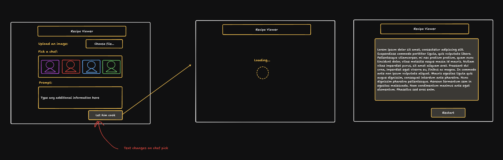

# Recipe Viewer

This app uses computer vision to analyse a picture and provide a recipe.

## Concept

A user can upload an image of some food they wanna eat. Maybe they've seen a picture on Instagram, taken a photo of a meal they ate, or want to recreate great-grandma Nora's long lost recipe for apple crumble.

The user can include a prompt alongside their image and select a chef to give them back their recipe.

We sketched out idea first using tldraw and set up this repo with a rough structure.

